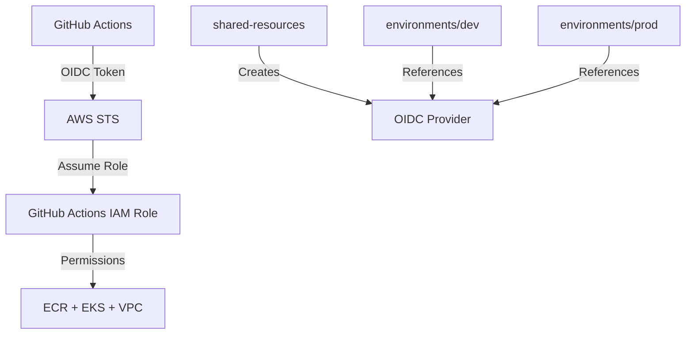

# 🔄 Repository Migration & New AWS Account Guide

## 📋 Scenarios & Solutions

### 1️⃣ **Fork Repository to Different GitHub Account** 
✅ **Works out of the box**

**Steps:**
1. Fork repository to new GitHub account
2. Update `terraform.tfvars`:
   ```hcl
   github_org  = "new-github-username"  
   github_repo = "new-repo-name"
   ```
3. Run GitHub Actions - will work immediately!

**Why it works:**
- IAM trust policy uses variables from `terraform.tfvars`
- No hardcoded repository names in infrastructure

---

### 2️⃣ **Deploy to New AWS Account**
⚠️ **Requires initial local setup**

**Steps:**
1. Configure AWS credentials for new account
2. Run setup script:
   ```bash
   ./setup-new-aws-account.sh dev
   ```
3. Add GitHub Secrets manually
4. GitHub Actions will work for subsequent deployments

**Why local setup needed:**
- OIDC Provider must exist before IAM roles can reference it
- Chicken-and-egg problem: GitHub Actions needs OIDC to create OIDC

---

## 🛠️ **Setup Script Usage**

### For Development Environment:
```bash
./setup-new-aws-account.sh dev
```

### For Production Environment:
```bash
./setup-new-aws-account.sh prod
```

### Manual Steps After Script:
1. Go to GitHub → Settings → Secrets and Variables → Actions
2. Add secrets displayed by the script:
   - `AWS_ROLE_ARN_DEV`: (from script output)
   - `AWS_ROLE_ARN_PROD`: (from script output)

---

## 🔍 **Architecture Overview**



### Key Components:
- **OIDC Provider**: Created once in `shared-resources`
- **IAM Roles**: Created per environment, references OIDC Provider
- **Trust Policy**: Scoped to specific GitHub repository

---

## 🚨 **Troubleshooting**

### Error: "No OIDC provider found"
```
Error: reading IAM OIDC Identity Provider: NoSuchEntity
```
**Solution:** Run `./setup-new-aws-account.sh` first

### Error: "EntityAlreadyExists"  
```
Error: creating IAM Role: EntityAlreadyExists
```
**Solution:** Import existing resources:
```bash
terraform import module.eks.aws_iam_role.eks_cluster ROLE-NAME
```

### GitHub Actions Permission Denied
**Solution:** Verify GitHub secrets are correctly set and match Terraform outputs

---

## 📦 **What the Setup Script Does**

1. **Creates OIDC Provider** (`shared-resources`)
   - Enables GitHub Actions to authenticate with AWS
   - Required once per AWS account

2. **Creates Infrastructure** (`environments/dev` or `prod`)
   - IAM roles with comprehensive permissions
   - EKS cluster and ECR repository
   - VPC and networking

3. **Displays Setup Information**
   - GitHub secrets to add manually
   - Resource ARNs and endpoints

---

## ✅ **Validation Checklist**

After setup, verify:
- [ ] OIDC Provider exists in AWS IAM
- [ ] GitHub Actions role has correct trust policy
- [ ] ECR repository is created
- [ ] EKS cluster is running
- [ ] GitHub secrets are added
- [ ] GitHub Actions pipeline runs successfully

---

## 🔐 **Security Notes**

- IAM roles use least-privilege principle
- Trust policy scoped to specific repository
- Temporary credentials (1 hour sessions)
- No long-lived access keys required

For questions, see [TROUBLESHOOTING.md](./TROUBLESHOOTING.md)
